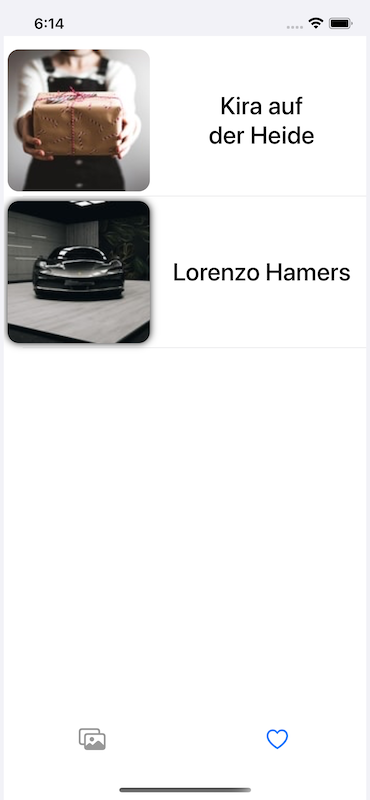

# Unsplash

#### Проект по показу изображений с сервиса Unsplash:

- Реализован только кодом
- Потрачено на разрабоку 15 часов сидения за экраном
- Использовал в качестве сторонней библиотеки KingFisher

#### Важный момент при тестировании!!! 
- ОГРАНИЧЕНИЕ НА 50 ЗАПРОСОВ В ЧАС (ограничение API)

#### Паттерны:

- SimpleFactory
- Facade
- Memento (Caretaker)
- Singleton

#### Стэк технологий:

- URLSession
- GCD
- UIKit
- AutoLayout
- UIAnimations
- Notifications
- UserDefaults

# Коротко о функционале:

- После запуска приложения идет загрузка случаных изображений с сервиса
- Фотографии так-же можно искать набрав в строке поиска свой запрос
- Нажав на ячейку переходим в экран с детальной информацией
- Если нажать на сердце, то модель изображения добавится в локальное хранилище
- Если нажать еще раз то модель оттуда будет удалена
- Если нажать два раза на изображение, то оно сохраниться в "Фото" вашего устройства
- Лайкнутые изображения можно просмотреть в таблице избранного (изначально она пуста)

